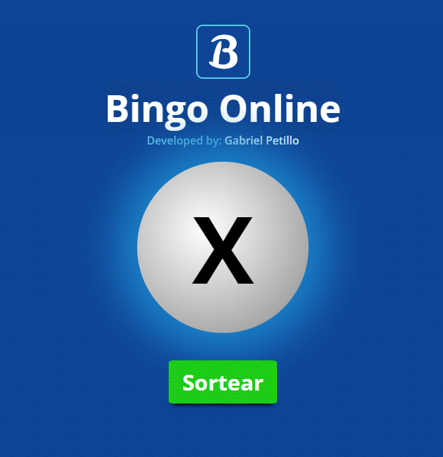

# Bingo Online 🔢

<a href="https://www.bingoonline.tk"></a>

### 🌐 Website
<a href="https://www.bingoonline.tk">https://www.bingoonline.tk</a> or<br>
<a href="https://bingo-online.vercel.app/">https://bingo-online.vercel.app/</a>

### Description

Project to develop an online bingo website, with raffle, card generation, validation and other features.

## 🏃🏻 Run Project 

1. Clone the Github Repo

    ```ps
    git clone https://github.com/gspetillo/bingo-online.git
    ```

2. Open the `App/index.html` file

3. Ready! Use the app, play and contribute

## 🤝🏻 Contributing

1. Clone the Github Repo

    ```ps
    git clone https://github.com/gspetillo/bingo-online.git
    ```

2. Code your feature or issue in your favorite IDE (I prefer [Visual Studio Code](https://code.visualstudio.com/)

3. Create a branch from `development` named with your feature.
    - example: my feature is Card Validation, so the branch will be named `card-validation`

3. Commit your changes
    - using semmantic commits and best pratices.
        
        Read more: https://nitayneeman.com/posts/understanding-semantic-commit-messages-using-git-and-angular/

4. Push your commits to your repo
    
    ```ps
    git push your_remote_name your_branch_name
    ```

5. Open a Pull Request on the main repo

6. Keep track of comments and review of changes

7. When your issue is merged, request space in the contributors section

## 🧑🏻‍💻 Contributors

### 🪧 Owner

<div style="width: 100px"><a href="https://www.linkedin.com/in/gabrielpetillo/"><p style="text-align: center; font-size: 12px; font-weight: bold">Gabriel Petillo 👑</p></a></div>

### 💯 Contributors

<div style="width: 100px"><a href="https://www.linkedin.com/in/jjean-jacques10/"><p style="text-align: center; 
font-size: 12px; font-weight: bold">Jean Jacques 🎖️</p></a></div>
